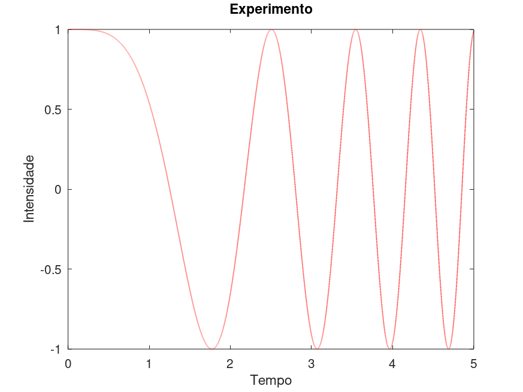

# MS211 - Cálculo Numérico

Notas de aula tomadas ao longo da disciplina MS211 - Cálculo Numérico, ministrada pelo professor Ricardo Biloti e oferecido da Universidade Estadual de Campinas (Unicamp).

Para produção destas notas, foram utilizadas como referências os conteúdos expostos nas aulas presenciais ministradas pelo professor Biloti, bem como o [curso online][] oferecido por ele. A estrutura deste documento segue a estrutura em que as aulas estão organizadas no [curso online][].

[curso online]: https://www.ime.unicamp.br/~biloti/an/211/index.html

---

```toc
```

---

## Introdução ao Octave

Octave é um ambiente para computação científica numérica interativo e expansível, altamente compatível com MATLAB. É uma linguagem de programação de alto-nível e de software livre (GNU GPL).

Por padrão, o Octave exibe os números com 5 algarismos significativos. Para exibir mais dígitos decimais, devemos utilizar o comando `format long`, que aumenta a exibição para 16 algarismos significativos.

Para definir uma variável,, utilizamos a sintaxe `nome = valor`. Por exemplo:

```Matlab
octave:1> p1 = 8.6
p1 = 8.6000
```

Por padrão, será exibido como saída o valor atribuído à variável. Para suprimir esse *output*, basta adicionar um ponto-e-vírgula (`;`) ao final do comando:

```Matlab
octave:2> p2 = 7.3;
```

Note que o valor `7.3` ainda foi atribuído à variável `p2`, apenas a saída na tela foi suprimida. Podemos verificar isso apenas digitando o nome da variável no console:

```Matlab
octave:3> p2
p2 = 7.3000
```

Podemos definir variáveis em função de outras variáveis, por exemplo:

```Matlab
octave:4> m = 0.4 * p1 + 0.6 * p2;
octave:5> m
m = 7.8200
```

O caractere de cerquilha (`#`) é utilizado para iniciar comentários, ou seja, tudo que for escrito na mesma linha depois dele é ignorado pelo Octave durante a avaliação dos comandos.

```Matlab
octave:6> m = 0.4 * p1 + 0.6 * p2;   # média do curso
```

O Octave também nos permite trabalhar com vetores e matrizes. Para definir um vetor, utilizamos colchetes:

```Matlab
octave:7> x = [1; -1]
x =

   1
  -1

```

No código acima, foi criado um vetor coluna com duas entradas (o caractere de ponto-e-vírgula é utilizado para separar linhas distintas). Com isso, podemos definir matrizes:

```Matlab
octave:8> A = [ 2, 0; 3, 1]
A =

   2   0
   3   1

```

A vírgula é utilizada para separar os elementos dentro de uma mesma linhas, mas quando não há ambiguidade, podemos separá-los apenas por um espaço em branco:

```Matlab
octave:9> A = [2 0; 3 1]
A =

   2   0
   3   1

```

Com isso, podemos também calcular o produto de uma matriz por um vetor:

```Matlab
octave:10> y = A*x
y =

   2
   2

```

O Octave permite também a resolução de sistemas lineares. Para resolver o sistema `Ax = b`, por exemplo, utilizamos o comando `x = A\b`:

```Matlab
octave:11> b = [ 2; -1]
b =

   2
  -1

octave:12> x = A\b
x =

   1
  -4

```

Além disso, o Octave permite também que façamos gráficos por meio da função `fplot`:

```Matlab
octave:13> fplot("cos(x)", [0, 2*pi])
```


Além das funções internas, podemos também definir nossas próprias funções, por meio da sintaxe `nome = @(argumentos) expressão`:

```Matlab
octave:14> fun = @(x) cos(2*x)
fun =

@(x) cos (2 * x)

octave:15> fplot(fun, [0 2*pi])
```


Um outro recurso muito importante do Octave são as operações vetoriais, ou seja, matriciais. Para isso, além das operações tradicionais (soma, subtração, multiplicação e divisão), temos também as operações ponto-a-ponto, representadas por um ponto antes do operador aritmético.

```Matlab
octave:16> x = [2, 3, -1, 6]
x =

   2   3  -1   6

octave:17> x*x
error: operator *: nonconformant arguments (op1 is 1x4, op2 is 1x4)
octave:18> x .* x
ans =

    4    9    1   36

```

No exemplo acima, o operador `*` tenta realizar a multiplicação dos vetores (como matrizes 1x4), o que não é possível. Utilizando, porém, o operador `.*`, é feita a multiplicação elemento-a-elemento das entradas de `x`, de modo que a operação é válida. Alternativamente, podemos utilizar o operador `.^` para elevar todos os elementos do vetor ao quadrado:

```Matlab
octave:19> x.^2
ans =

    4    9    1   36

```

Para extrair apenas um elemento de um vetor, utilizamos a sintaxe `nome(índice)`:

```Matlab
octave:20> a = x(3)
a = -1
```

**Atenção:** no Octave, todos os índices iniciam em 1.

Podemos também pegar vários valores ao mesmo tempo. Para isso, utilizamos a sintaxe `nome-do-vetor(início:salto:fim)`, para pegar todos os elementos dentro do intervalo especificado, ou passar um vetor com os índices dos elementos desejados:

```Matlab
octave:21> x = [1 2 3 4 5 6 7 8 9] / 10
x =

   0.1000   0.2000   0.3000   0.4000   0.5000   0.6000   0.7000   0.8000   0.9000

octave:22> b = x(2:2:end)  # pega apenas os elementos em posições pares
b =

   0.2000   0.4000   0.6000   0.8000
octave:23> c = x(1:4)  # pega os elementos nas posições 1 a 4
c =

   0.1000   0.2000   0.3000   0.4000

octave:24> d = x([1 3 4 9])  # pega os elementos nas posições 1, 3, 4 e 9
d =

   0.1000   0.3000   0.4000   0.9000

```

Para limpar o terminal, utilizamos o comando `clc` (limpa a janela de comandos, mas mantém as variáveis). Para limpar as variáveis, utilizamos o comando `clear` (limpa as variáveis, mas mantém a janela de comandos).

Para fazer repetições dentro do Octave, podemos utilizar a estrutura `for`, com a seguinte sintaxe:

```txt
for variável=intervalo
    expressão
endfor
```

Por exemplo, para computar os 10 primeiros termos da sequência de Fibonacci, podemos utilizar o seguinte trecho de código:

```Matlab
octave:25> n = 10;
octave:26> f = zeros(1,n);  # gera uma matriz de 1 linha e n colunas preenchida por zeros
octave:27> f
f =

  0  0  0  0  0  0  0  0  0  0

octave:28> f(1) = 1;
octave:29> f(2) = 1;
octave:30> for k=3:n
> f(k) = f(k-1) + f(k-2);
> endfor
octave:31> plot(f, 'x')
```


No exemplo acima, foi utilizada a função `plot`, que cria um gráfico com os valores armazenados em f (em função dos índices, ou seja, `plot(f): i -> f(i)`). Por padrão, será gerada uma linha conectando os ponto, porém podemos passar como argumento, após o vetor, o formato desejado, por exemplo: `'x'` (marca os pontos com X), `'o'` (marca os pontos com O) e `'o-'` (marca os pontos com O e os conecta com segmentos de reta).

Para customizar a exibição de um gráfico criado com `fplot`:

```Matlab
octave:1> f = @(x) sin(x) ./ (1+x);
octave:2> fplot(f, [0,5], 'r', 'linewidth', 2)

octave:3> title("Experimento")

octave:4> xlabel("Tempo")

octave:5> ylabel("Intensidade")

octave:6> legend("off")
```


Suponha agora que desejamos criar outro gráfico, utilizando outra função, porém com as mesmas configurações do gráfico anterior. Para isso, podemos criar um arquivo (digamos, `grafico.m`) e nele adicionar os comandos que desejamos executar:

```Matlab
fplot(f, [0,5], 'r', 'linewidth', 2)
title("Experimento")
xlabel("Tempo")
ylabel("Intensidade")
legend("off")
```

Para gerar um gráfico com essas configurações, basta executar um comando com o nome do arquivo:

```Matlab
octave:1> f = @(x) cos(x.^2);
octave:2> grafico
```



Chamamos esse tipo de arquivo, que guarda uma sequência de comandos a ser executada, de um *script*.

No entanto, um *script* acessa diretamente as variáveis que estão definidas no ambiente de trabalho. No exemplo anterior, caso quiséssemos criar o gráfico de uma função `g`, por exemplo, não seria possível (o script definido cria apenas o gráfico da `f`). Para construir um bloco de comandos, mas de forma que seja possível informar quais parâmetros ele deve usar, devemos definir uma função:

```Matlab
function [seq, razao] = fibo(N)
    seq = ones(1,N);
    for k=3:N
        seq(k) = seq(k-1) + seq(k-2);
    endfor
    razao = seq(N) / seq(N-1);
endfunction
```

Para definir uma função, devemos escrever a palavra-chave `function`, seguida pelo nome da variável que será retornada (se for mais de uma, escrever em forma de vetor), um símbolo de atribuição (`=`), o nome da função e os parâmetros entre parêntese. Para encerrar uma função, devemos utilizar a palavra-chave `endfunction`.

```Matlab
octave:1> fibo(10)
ans =

    1    1    2    3    5    8   13   21   34   55

octave:4> seq = fibo(10)
seq =

    1    1    2    3    5    8   13   21   34   55

```

Caso apenas chamemos a função, sem armazenar o valor em uma variável, ou atribuamos o retorna da função a apenas uma variável, apenas o primeiro valor do retorno será exibido/armazenado. Para armazenar todos os valores, devemos atribuir o retorno da função a um vetor com o mesmo número de elementos do retorno:

```Matlab
octave:5> [s, r] = fibo(10)
s =

    1    1    2    3    5    8   13   21   34   55

r = 1.6176
```

Nesse caso, o nome das variáveis de entrada e saída no ambiente de trabalho não tem relação com os nomes das variáveis dentro da função

Para escrever a documentação de uma função recém-definida, escrevemos uma docstring logo abaixo da definição da função:

```Matlab
function [seq, razao] = fibo(N)
# function [seq, razao] = fibo(N)
#
# Computa os N primeiros termos da sequência de Fibonacci e retorna a razão entre os últimos dois.

   seq = ones(1,N);
    for k=3:N
        seq(k) = seq(k-1) + seq(k-2);
    endfor
    razao = seq(N) / seq(N-1);
endfunction
```

Com isso, podemos utilizar o comando `help` para exibir ajuda sobre a nossa função:

```Matlab
octave:1> help fibo
'fibo' is a function from the file /home/lozavival/Octave/fibo.m

 function [seq, razao] = fibo(N)

 Computa os N primeiros termos da sequência de Fibonacci e retorna a razão entre os últimos dois.


Additional help for built-in functions and operators is
available in the online version of the manual.  Use the command
'doc <topic>' to search the manual index.

Help and information about Octave is also available on the WWW
at https://www.octave.org and via the help@octave.org
mailing list.
```

Um script é uma sequência pré-definida de comandos, salva em um arquivo texto, que pode ser executada pelo Octave, como se fosse um comando interno do próprio Octave. Para isso, o arquivo deve ter extensão `.m` e estar na pasta onde o Octave está sendo executado, ou ter sua localização indicada pela variável de ambiente `path`.

Uma função difere de um script por ter seu próprio espaço de variáveis, separado do espaço de variáveis do ambiente de trabalho do usuário. Assim como um script, uma função deve estar salva em um arquivo texto, também com a extensão `.m`, com a condição que o nome do arquivo deve ser igual ao nome da função.
