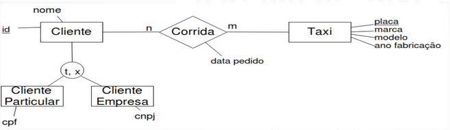

# MC536 - Bancos de Dados

Descrição

---

```toc
```

---

## Modelagem e Mapeamento ER

## Álgebra Relacional

## SQL

Referência: <https://drive.google.com/file/u/1/d/1Aova3-xfDxDyqtnyba5bBFnKlWRinPgM/view?usp=drive_web>

Structure Query Language (SQL) é uma linguagem **declarativa** para manipulação e recuperação de dados; é a linguagem padrão para os SGBDs relacionais.

Ela é dividida em 4 módulos:

- Linguagem de Definição de Dados (DDL)
    - Definir esquemas de relação, excluir relações e modificar esquemas
- Linguagem de Manipulação de Dados (DML)
    - Inserir, excluir e modificar dados e linguagem de consulta
    - Inspirada em Álgebra Relacional
- Linguagem de Controle de Dados (DCL)
    - Gerenciar aspectos de controle de acesso entre usuários e dados
- Linguagem de Transação de Dados (DTL)
    - Gerenciar aspectos de transações

### Definição de Dados (DDL)

- **Objetos:**
    - Esquemas (Bancos de dados)
    - Tabela (Relação)
    - Visões (views)
    - Asserções
    - Gatilhos (triggers)
- **Paralelos com Modelo Relacional:**
    - Tabela = Relação
    - Linha = Tupla
    - Coluna = Atributo

#### CREATE

Cria um objeto dentro da base de dados. Há dois tipos de CREATE: *CREATE SCHEMA*, por meio do qual criamos partições do banco de dados, e *CREATE TABLE*, para criar tabelas.

Para criar um banco de dados utilizamos o seguinte comando:

```sql
CREATE DATABASE <nome_do_banco>
```

O comando a seguir é utilizado para criar tabelas dentro do banco de dados:

```sql
CREATE TABLE <tabela> (
<campo1> <tipo>,
[..., <campon> <tipo>]
PRIMARY KEY <coluna>
FOREIGN KEY <coluna> REFERENCES <tabela_ref>(<coluna_ref>)
)
```

- Tipos de domínios básicos:
    - CHAR(n), VARCHAR(n), INTEGER, DOUBLE, FLOAT, BOOLEAN, DATE, etc.
- PRIMARY KEY: restrição de chave primária.
- FOREIGN KEY: restrição de chave estrangeira.
- Outras restrições:
    - NOT NULL: proíbe valores nulos na coluna.
    - UNIQUE: proíbe valores repetidos na coluna.
    - CHECK: limita o intervalo de valores que pode ser inserido na coluna.

Por exemplo, para criar um banco para um sistema de táxi (modelado na imagem abaixo), podemos utilizar o seguinte script:



```sql
CREATE DATABASE sistema_taxi;
USE sistema_taxi;

CREATE TABLE cliente (
    id VARCHAR(4),
    nome VARCHAR(80),
    PRIMARY KEY(id)
);

CREATE TABLE cliente_particular (
    id VARCHAR(4),
    cpf VARCHAR(14),
    PRIMARY KEY(id),
    FOREIGN KEY(id) REFERENCES cliente(id)
);

CREATE TABLE cliente_empresa (
    id VARCHAR(4),
    cnpj VARCHAR(18),
    PRIMARY KEY(id),
    FOREIGN KEY(id) REFERENCES cliente(id)
);

CREATE TABLE taxi (
    placa VARCHAR(7),
    marca VARCHAR(30),
    modelo VARCHAR(30),
    anofab INTEGER,
    PRIMARY KEY(placa)
);

CREATE TABLE corrida (
    cliid VARCHAR(4),
    placa VARCHAR(7),
    dataPedido DATE,
    PRIMARY KEY(cliid, placa, dataPedido),
    FOREIGN KEY(cliid) REFERENCES cliente(id),
    FOREIGN KEY(placa) REFERENCES TAXI(placa)
);
```

#### ALTER

Altera um objeto já existente (especificamente, altera esquemas).

Os comandos abaixo servem, respectivamente, para adicionar e remover uma coluna:

```sql
ALTER TABLE <tabela> ADD <coluna><tipo>
ALTER TABLE <tabela> DROP <coluna>
```

É possível utilizar as restrições mencionada acima (NOT NULL, UNIQUE, CHECK) ao criar uma nova coluna.

#### DROP

Apaga um objeto do banco de dados. Por exemplo, o comando abaixo exclui uma tabela existente:

```sql
DROP TABLE <tabela>
```

### Manipulação de Dados (DML)

#### INSERT

Insere linhas (tuplas) uma relação. O comando INSERT insere todos os atributos da linha, na mesma ordem especificada no CREATE TABLE.

```sql
INSERT INTO <tabela>
VALUES (valor1, valor2, ..., valorn)
```

É possível também inserir somente alguns atributos especificados:

```sql
INSERT INTO <tabela> (campo1, campo2, ..., campon)
VALUES (valor1, valor2, ..., valorn)
```

Por exemplo, podemos usar o seguinte script para popular o banco Sistema de Taxi criado anteriormente:

```sql
INSERT INTO cliente VALUES
    ('1755', 'Doriana'),
    ('93','DinoTech'),
    ('1532','Asdrúbal'),
    ('1780','Quincas'), ('97','Proj');
INSERT INTO cliente_particular VALUES
    ('1755', '567.387.387-44'),
    ('1532', '448.754.253-44'),
    ('1780', '576.456.123-55');
INSERT INTO cliente_empresa VALUES ('93', '58.443.828/0001-02'), ('97', '44.876.234/7789-10');
INSERT INTO taxi VALUES
    ('DAE6534','Ford','Fiesta',1999),
    ('DKL4598','Volkswagen','Gol',2001),
    ('DKL7878','Ford','Fiesta',2001),
    ('JDM8776','Volkswagen','Santana',2002),
    ('JJM3692','Chevrolet','Corsa',1999);
INSERT INTO corrida VALUES ('1755', 'DAE6534', '2003-02-15'), ('97', 'JDM8776', '2003-02-18');
```

#### UPDATE

Modifica os valores dos atributos das linhas da tabela em que o predicado especificado seja verdadeiro:

```sql
UPDATE <tabela>
SET <campo1> = <valor1> [, ..., <campon> <valorn>]
WHERE <condição>
```

Por exemplo, podemos utilizar o comando abaixo para alterar o nome do cliente cujo id é 93 para "Doris":

```sql
UPDATE cliente
SET nome = 'Doris'
WHERE id = '93'
```

**Cuidado:** uma atualização no valor da chave primária pode propagar-se, dependendo de como a restrição de chave estrangeira foi criada.

#### DELETE

Exclui todos os registros da tabela em que o predicado especificado seja verdadeiro:

```sql
    DELETE FROM <tabela> WHERE <condição>
```

A exclusão não pode violar as restrições de integridade referencial (chave estrangeira). Apesar disso, alguns SGBDs permitem exclusões em cascata.

#### SELECT

Realiza uma consulta aos dados presentes no banco.

A estrutura básica contém os seguintes elementos:

- **Lista de atributos:** nomes dos atributos a serem recuperados pela consulta. Quando a lista de tributos envolver todos os atributos da relação, pode-se usar `*`.
- **Lista de tabelas:** nomes das tabelas envolvidas no processamento da consulta. Se mais de uma tabela for fornecida, será feita operação de produto cartesiano ou junção.
- **Condição:** expressão booleana que identifica as linhas a serem recuperadas pela consulta. Pode conter:
    - Conectivos lógicos: AND, OR e NOT
    - Operadores de comparação: <, <=, >, >=, =, <>
    - Comparador de string: `LIKE <expressão regular>`. Utilizamos `%` para indicar qualquer número de caracteres e `_` para um número fixo de caracteres. Por exemplo, a expressão regular `%3f_` indica que queremos todas as strings em que o antepenúltimo caractere seja "3" e o penúltimo seja "f".

```sql
SELECT <lista de colunas>
FROM <lista de tabelas>
[WHERE <condição>]
[GROUP BY <coluna_agrupar>]
[HAVING <condição_grupo>]
[ORDER BY <lista de atributos>]
```

Apenas as cláusulas SELECT e FROM são obrigatórias; quando existentes, as cláusulas devem aparecer nessa ordem.

**Observação:** ao contrário da álgebra relacional, o SELECT não elimina repetições do resultado (ou seja, pode retornar tuplas repetidas). Para suprimir esse comportamento e forçar que apenas retorne tuplas distintas, é necessário usar a palavra-chave DISTINCT:

```sql
SELECT DISTINCT <atributos> FROM <tabela>
```

Para acessar um campo específico de uma tabela, utilizamos a notação `tabela.campo`:

```sql
SELECT cliente.nome, taxi.modelo
FROM cliente, taxi
WHERE cliente.anoNascimento = taxi.anoFabricacao
```

##### Alias

O uso de um *alias* permite associar nomes alternativos para tabelas e colunas ao fazermos consultas. Ao ser aplicado em colunas, o alias tem o mesmo papel de uma operação de rename ($\rho$) da álgebra relacional:

```sql
SELECT anofab AS fabri
FROM taxi AS carro
```

##### Ordenação

O comando `ORDER BY` ordena a exibição dos registros resultantes da consulta. O padrão é ordem crescente (`ASC`), porém é possível especificar ordem decrescente por meio da palavra-chave `DESC`:

```sql
SELECT
...
ORDER BY <lista de atributos> [ASC|DESC]
```

##### Agrupamento

O comando `GROUP BY` agrupa linhas da tabela que compartilham os mesmos valores em todas as colunas da lista. Por exemplo, o comando `SELECT marca, count(*) FROM taxi GROUP BY marca;` tem como resultado uma tabela contendo a contagem de táxis de cada marca.

Podemos utilizar ainda o comando `HAVING` para restringir os resultados do GROUP BY quando a condição é verdadeira. Seguindo o exemplo anterior, podemos executar o comando `SELECT marca FROM taxi GROUP BY marca HAVING count(*) > 2;` para retornarmos uma tabela contendo as marcas de taxi que aparecem mais de 2 vezes na tabela.

##### SELECT x Álgebra Relacional

- Projeção ($\pi$):
    - `SELECT [<lista de atributos>] FROM <tabela>`
    - Exemplo: $\pi_{\text{marca, modelo}} \; \text{taxi}$ --> `SELECT marca, modelo FROM taxi`
- Seleção ($\sigma$):
    - `SELECT * FROM <tabela> WHERE <predicado>`
    - Exemplo: $\sigma_{\text{anofab > 2000}} \; \text{taxi}$ --> `SELECT * FROM Taxi WHERE anofab > 2000`
- Produto Cartesiano ($\times$):
    - `SELECT * FROM <tabela1>, <tabela2>`
    - Exemplo: $\text{cliente} \times \text{taxi}$ --> `SELECT * FROM cliente, taxi`
- Junção ($\Theta$):
    - `SELECT * FROM <tabela1>, <tabela2> WHERE <predicado>`
