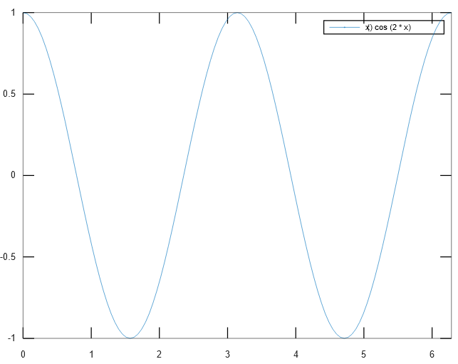
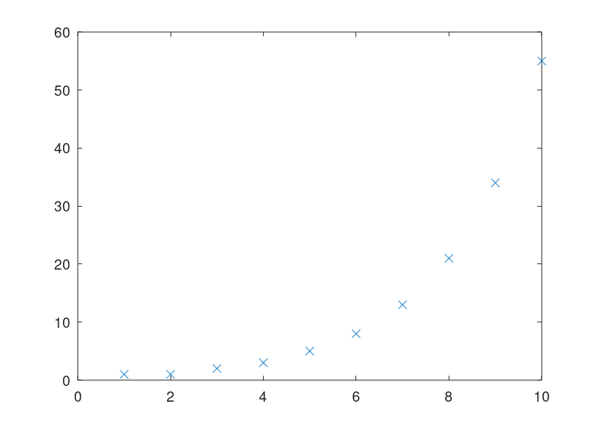
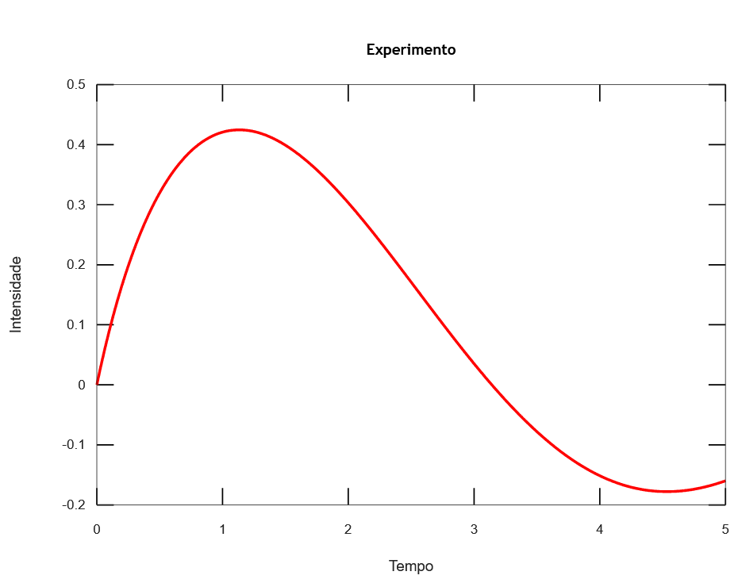
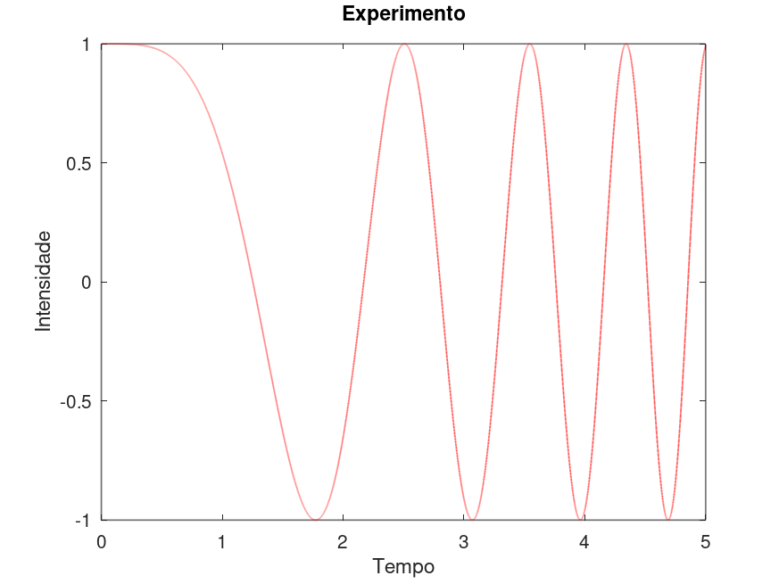

# MS211 - Cálculo Numérico

**Palavras-chave:**

Notas de aula tomadas ao longo da disciplina MS211 - Cálculo Numérico, ministrada pelo professor Ricardo Biloti e oferecido da Universidade Estadual de Campinas (Unicamp).

Para produção destas notas, foram utilizadas como referências os conteúdos expostos nas aulas presenciais ministradas pelo professor Biloti, bem como o [curso online][] oferecido por ele. A estrutura deste documento segue a estrutura em que as aulas estão organizadas no [curso online][].

[curso online]: https://www.ime.unicamp.br/~biloti/an/211/index.html

---

## Introdução ao Octave

[Octave](https://octave.org/) é uma linguagem de programação de alto-nível e também um ambiente para computação científica numérica interativo e expansível altamente compatível com MATLAB, porém de software livre (GNU GPL).

Pelo fato de ser interativo, podemos utilizar o Octave por meio de uma janela de comandos, capaz de interpretar e executar os comandos passados e armazenar o estado das variáveis criadas. Para limpar a janela de comandos, utilizamos o comando `clc` (limpa a janela de comandos, mas mantém as variáveis). Para limpar as variáveis, utilizamos o comando `clear` (limpa as variáveis, mas mantém a janela de comandos).

### Declaração de Variáveis

Para definir uma variável, utilizamos a sintaxe `nome = valor`. Por padrão, o valor atribuído à variável será exibido como saída. Para suprimir esse *output*, basta adicionar um ponto-e-vírgula (`;`) ao final do comando.

```Matlab
octave:1> p1 = 8.6
p1 = 8.6000
octave:2> p2 = 7.3;
```

Note que, no exemplo, o valor `7.3` ainda foi atribuído à variável `p2`, apenas a saída na tela foi suprimida. Podemos verificar isso apenas digitando o nome da variável no console:

```Matlab
octave:3> p2
p2 = 7.3000
```

Por padrão, o Octave exibe os números com 5 algarismos significativos. Para exibir mais dígitos decimais, devemos utilizar o comando `format long`, que aumenta a exibição para 16 algarismos significativos (é possível voltar ao formato curto por meio do comando `format short`).

Além de valores numéricos, podemos também definir variáveis em função de outras variáveis, por exemplo:

```Matlab
octave:4> m = 0.4 * p1 + 0.6 * p2;   # média do curso
octave:5> m
m = 7.8200
```

No exemplo acima, o caractere de cerquilha (`#`) é utilizado para escrever comentários, ou seja, tudo que for escrito na mesma linha depois dele é ignorado pelo Octave durante a avaliação dos comandos.

### Vetores e Matrizes

O Octave também nos permite trabalhar com vetores e matrizes. Para definir um vetor e armazená-lo em uma variável, devemos escrever os elementos do vetor entre colchetes:

```Matlab
octave:6> x = [1; -1]
x =

   1
  -1

```

No exemplo acima, a variável `x` armazena um vetor coluna com duas entradas. Sabendo definir vetores, podemos definir também matrizes. Assim como no exemplo acima, o caractere de ponto-e-vírgula é utilizado para separar linhas distintas, enquanto a vírgula é utilizada para separar os elementos dentro de uma mesma linha (quando não há ambiguidade, porém, podemos separá-los apenas por um espaço em branco.

```Matlab
octave:7> A = [2, 0; 3, 1]
A =

   2   0
   3   1

octave:8> A = [2 0; 3 1]
A =

   2   0
   3   1

```

#### Operações com Vetores e Matrizes

Sabendo definir vetores e matrizes, podemos também calcular o produto de uma matriz por um vetor:

```Matlab
octave:9> y = A*x
y =

   2
   2

```

Além disso, o Octave permite também a resolução de sistemas lineares. Para resolver o sistema `Ax = b`, por exemplo, utilizamos o comando `x = A\b`:

```Matlab
octave:10> b = [ 2; -1]
b =

   2
  -1

octave:11> x = A\b
x =

   1
  -4

```

Um outro recurso muito importante do Octave são as operações vetoriais, ou seja, matriciais (um vetor nada mais é que uma matriz com uma das dimensões de tamanho 1). Para isso, além das operações tradicionais (soma, subtração, multiplicação e divisão), temos também as operações ponto-a-ponto, representadas por um ponto antes do operador aritmético:

```Matlab
octave:12> x = [2, 3, -1, 6]
x =

   2   3  -1   6

octave:13> x*x
error: operator *: nonconformant arguments (op1 is 1x4, op2 is 1x4)
octave:14> x .* x
ans =

    4    9    1   36

```

No exemplo acima, o operador `*` tenta realizar a multiplicação dos vetores, o que não é possível. Utilizando, porém, o operador `.*`, é feita a multiplicação elemento-a-elemento das entradas de `x`, de modo que a operação é válida. Alternativamente, podemos utilizar o operador `.^` para elevar cada elemento do vetor ao quadrado:

```Matlab
octave:15> x.^2
ans =

    4    9    1   36

```

#### Indexação de Matrizes

Para extrair apenas um elemento de um vetor, utilizamos a sintaxe `nome-do-vetor(índice)`. **Atenção:** no Octave, todos os índices iniciam em 1.

```Matlab
octave:16> a = x(3)
a = -1
```

Podemos também pegar vários valores ao mesmo tempo. Para isso, utilizamos a sintaxe `nome-do-vetor(início:salto:fim)`, para pegar todos os elementos dentro do intervalo especificado (nesse caso, ambos índices fornecidos serão inclusivos), ou `nome-do-vetor([índices])`, para pegar os elementos nos índices informados:

```Matlab
octave:17> x = [1 2 3 4 5 6 7 8 9] / 10
x =

   0.1000   0.2000   0.3000   0.4000   0.5000   0.6000   0.7000   0.8000   0.9000

octave:18> b = x(2:2:end)  # pega apenas os elementos em posições pares
b =

   0.2000   0.4000   0.6000   0.8000

octave:19> c = x(1:4)  # pega os elementos nas posições 1 a 4
c =

   0.1000   0.2000   0.3000   0.4000

octave:20> d = x([1 3 4 9])  # pega os elementos nas posições 1, 3, 4 e 9
d =

   0.1000   0.3000   0.4000   0.9000

```

### Criação de Gráficos

Em Octave, podemos criar gráficos por meio da função `fplot`, utilizando a sintaxe `fplot(função, intervalo)`:

```Matlab
octave:21> fplot("cos(x)", [0, 2*pi])
```


#### Funções Anônimas

Além das funções internas do próprio Octave, podemos também definir nossas próprias funções, através da sintaxe `nome = @(argumentos) expressão`. Essas funções são chamadas de funções anônimas, e também podem ser plotadas por meio da função `fplot`:

```Matlab
octave:22> fun = @(x) cos(2*x)
fun =

@(x) cos (2 * x)

octave:23> fplot(fun, [0 2*pi])
```



#### Estruturas de Repetição

Uma das formas possíveis de se fazer repetições dentro do Octave é através da estrutura `for`, que criada por meio da seguinte sintaxe:

```txt
for variável=intervalo
    expressão
endfor
```

Por exemplo, para computar os 10 primeiros termos da sequência de Fibonacci, podemos utilizar o seguinte trecho de código:

```Matlab
octave:24> n = 10;
octave:25> f = zeros(1,n);  # gera uma matriz de 1 linha e n colunas preenchida por zeros
octave:26> f
f =

  0  0  0  0  0  0  0  0  0  0

octave:27> f(1) = 1;
octave:28> f(2) = 1;
octave:29> for k=3:n
> f(k) = f(k-1) + f(k-2);
> endfor
```

Para visualizar os dados armazenados em `f`, podemos utilizar a função `plot`, que cria um gráfico dos valores armazenados no vetor em função dos respectivos índices de cada elemento. Por padrão, os pontos serão conectados com segmentos de reta, porém podemos passar como argumento, após o vetor, o formato desejado, por exemplo: `'x'` (marca os pontos com X sem ligá-los), `'o'` (marca os pontos com O sem ligá-los) e `'o-'` (marca os pontos com O e os conecta com segmentos de reta).

```Matlab
octave:30> plot(f, 'x')
```



#### Customização de Gráficos

O Octave também fornece várias opções para customizar a exibição de um gráfico criado com `fplot`. Por exemplo, para alterar a cor e a grossura da linha, passamos essas informações como parâmetros da função `fplot` (vide exemplo abaixo), porém é necessário chamar outras funções para alterar o título do gráfico e o nome dos eixos (`title`, `xlabel` e `ylabel`, respectivamente):

```Matlab
octave:31> f = @(x) sin(x) ./ (1+x);
octave:32> fplot(f, [0,5], 'r', 'linewidth', 2)

octave:33> title("Experimento")

octave:34> xlabel("Tempo")

octave:35> ylabel("Intensidade")

octave:36> legend("off")
```



### Scripts e Funções

Suponha agora que desejamos criar outro gráfico, utilizando outra função, porém com as mesmas configurações do gráfico anterior. Para fazer isso, podemos criar um arquivo (digamos, `grafico.m`) e nele adicionar os comandos que desejamos executar:

```Matlab
fplot(f, [0,5], 'r', 'linewidth', 2)
title("Experimento")
xlabel("Tempo")
ylabel("Intensidade")
legend("off")
```

Para gerar um gráfico com essas configurações, basta utilizar o nome do arquivo como comando no terminal:

```Matlab
octave:37> f = @(x) cos(x.^2);
octave:38> grafico
```



Chamamos esse tipo de arquivo, que guarda uma sequência de comandos a ser executada, de um *script*.

No entanto, um *script* acessa diretamente as variáveis que estão definidas no ambiente de trabalho. No exemplo anterior, caso quiséssemos criar o gráfico de uma função `g`, por exemplo, não seria possível (o script definido cria apenas o gráfico de uma função "`f`"). Para construir um bloco de comandos reaproveitável, porém de forma que seja possível informar quais parâmetros ele deve usar, é necessário definir uma *function*. Para isso, devemos escrever a palavra-chave `function`, seguida pelo nome da variável que será retornada (se for mais de uma, escrever em forma de vetor), um símbolo de atribuição (`=`), o nome da função e os parâmetros entre parêntese. Para encerrar uma função, devemos utilizar a palavra-chave `endfunction`:

```Matlab
function [seq, razao] = fibo(N)
    seq = ones(1,N);
    for k=3:N
        seq(k) = seq(k-1) + seq(k-2);
    endfor
    razao = seq(N) / seq(N-1);
endfunction
```

Chamamos a execução de uma *function* da mesma forma que as funções internas do Octave, escrevendo seu nome na linha de comandos e passando os parâmetros entre parênteses:

```Matlab
octave:39> fibo(10)
ans =

    1    1    2    3    5    8   13   21   34   55

octave:40> seq = fibo(10)
seq =

    1    1    2    3    5    8   13   21   34   55

```

Caso apenas chamemos a função, sem armazenar o valor em uma variável, ou atribuamos o retorno da função a apenas uma variável, somente o primeiro valor do retorno será exibido/armazenado. Para armazenar todos os valores, devemos atribuir o retorno da função a um vetor com o mesmo número de elementos do retorno:

```Matlab
octave:41> [s, r] = fibo(10)
s =

    1    1    2    3    5    8   13   21   34   55

r = 1.6176
```

Nesse caso, o nome das variáveis de entrada e saída no ambiente de trabalho não tem relação com os nomes das variáveis dentro da função.

Escrevemos a documentação de uma função recém-definida adicionando comentários logo abaixo de sua definição:

```Matlab
function [seq, razao] = fibo(N)
% function [seq, razao] = fibo(N)
% 
% Computa os N primeiros termos da sequência de Fibonacci e retorna a razão entre os últimos dois.
   seq = ones(1,N);
    for k=3:N
        seq(k) = seq(k-1) + seq(k-2);
    endfor
    razao = seq(N) / seq(N-1);
endfunction
```

Com isso, podemos utilizar o comando `help` para exibir ajuda sobre a nossa função, da mesma forma que para funções internas do Octave:

```Matlab
octave:43> help fibo
'fibo' is a function from the file /home/lozavival/Octave/fibo.m

 function [seq, razao] = fibo(N)

 Computa os N primeiros termos da sequência de Fibonacci e retorna a razão entre os últimos dois.


Additional help for built-in functions and operators is
available in the online version of the manual.  Use the command
'doc <topic>' to search the manual index.

Help and information about Octave is also available on the WWW
at https://www.octave.org and via the help@octave.org
mailing list.
```

**Resumindo**: Um script é uma sequência pré-definida de comandos, salva em um arquivo texto (com a extensão `.m`), que pode ser executada pelo Octave como se fosse um comando interno. Para isso, o arquivo deve estar na pasta onde o Octave está sendo executado ou ter sua localização indicada pela variável de ambiente `path`. Uma função difere de um script por ter seu próprio espaço de variáveis, separado do espaço de variáveis do ambiente de trabalho do usuário. Assim como um script, uma função deve estar salva em um arquivo texto, também com a extensão `.m`, com a condição de que o nome do arquivo deve ser igual ao nome da função.
